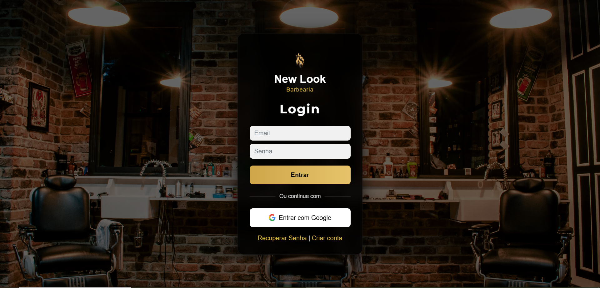
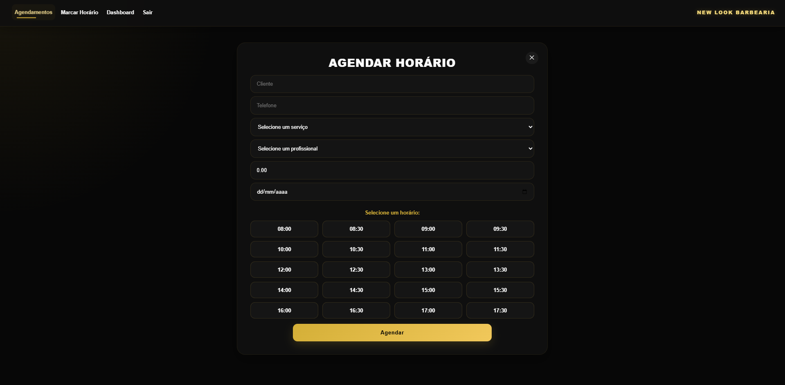
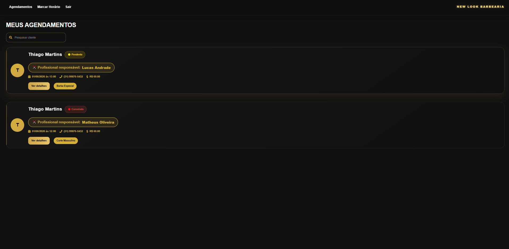
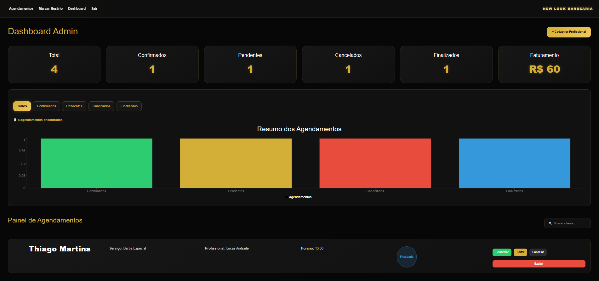
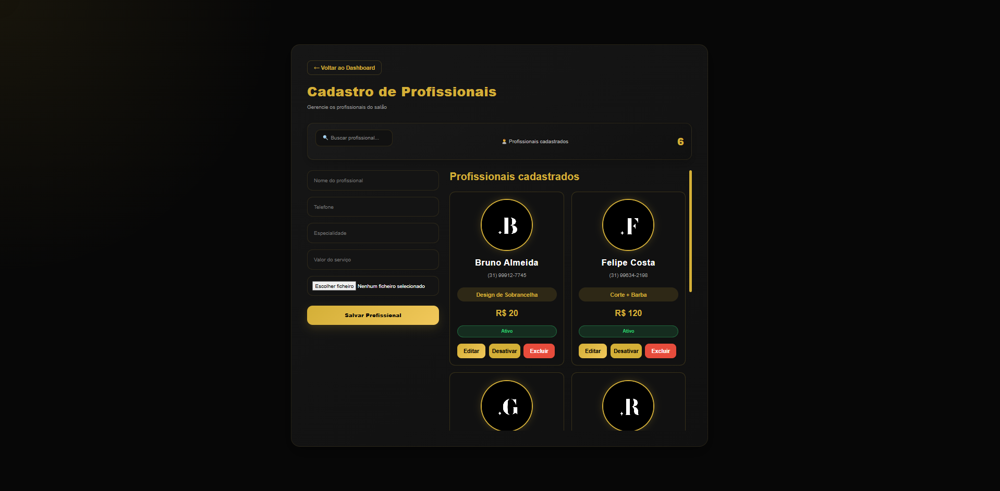

# 💈 Sistema de Agendamento para Salão

Este projeto é um sistema web desenvolvido para facilitar o agendamento de horários em um salão de beleza, evitando conflitos de horários e melhorando a organização dos atendimentos.

---

## 📸 Demonstração

### Tela de Login

<p align="center">
  
</p>

### Tela de Cadastro de Agendamento

<p align="center">
  
</p>

### Meus agendamentos

<p align="center">
  
</p>

### Dashboard Admin

<p align="center">
  
</p>

### Cadastro de Profissionais

<p align="center">
  
</p>

---

## 📌 Funcionalidades

👤 Área do Cliente
- 🔐 Sistema de login de usuários
- 🆕 Cadastro de novos usuários
- 📅 Agendamento de horários
- 🚫 Validação para evitar horários duplicados
- 📋 Visualização dos próprios agendamentos
- ✏️ Edição de agendamentos
- ❌ Cancelamento de agendamentos

---

🛡️ Área Administrativa
- 📊 Dashboard administrativo
- 📈 Gráfico de acompanhamento dos agendamentos
- 📋 Visualização de todos os atendimentos
- 🔍 Busca de clientes por nome
- 🏷️ Filtros por status dos agendamentos
- ✅ Confirmação de agendamentos
- 🎯 Finalização de atendimentos
- ❌ Cancelamento de atendimentos
- 🗑️ Exclusão de agendamentos
- 💰 Cálculo de faturamento estimado
-  📊 Indicadores em tempo real:
  - Total de agendamentos
  - Confirmados
  - Pendentes
  - Cancelados
  - Finalizados

---

✂️ Gestão de Profissionais
-➕ Cadastro de profissionais
-✏️ Edição de profissionais
-🗑️ Exclusão de profissionais
-🔍 Busca de profissionais por nome
-🟢 Ativação e desativação de profissionais
-📸 Upload de foto do profissional
-💵 Cadastro de valor do serviço
-🎯 Cadastro de especialidade
-📋 Listagem de profissionais cadastrados

---

## 🛠️ Tecnologias utilizadas
- React.js
- JavaScript (ES6+)
- Firebase Authentication
- Firebase Firestore
- Firebase Storage
- React Router DOM
- Redux
- Recharts
- HTML5
- CSS3  

---

## ▶️ Como executar o projeto

### 1. Clonar o repositório
```bash
git clone https://github.com/carolrodrigues-dev/salao.git
